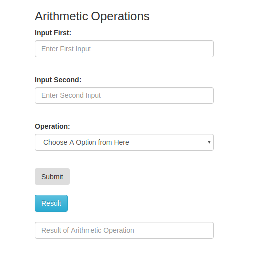
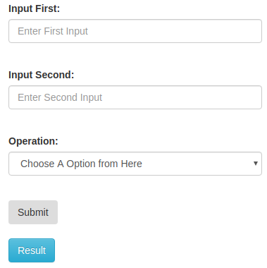

# Quick Start
## Arithmetic 
> In Today's world everybody wants to be done their work as fast as he can, Arithmetic solves your basic maths problem in that way.

## How to Use
> it's easy to use just follow below instructions:

**Program Picture**

1. Enter First Input

2. Enter Second Input

3. Choose your choice 

4. Submit your option

## Result of Maths Operation
1. Go to Result Box

2. see your answer

## Togglling your Answer
1. Just Click on Result Button and see the Magic

